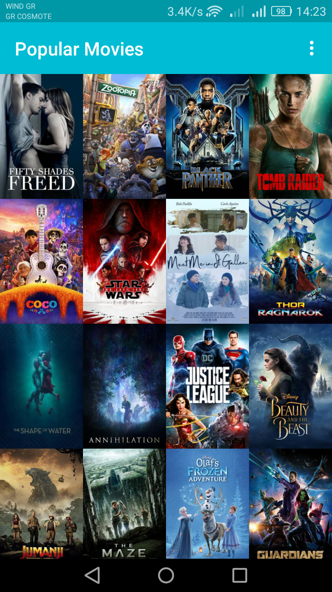
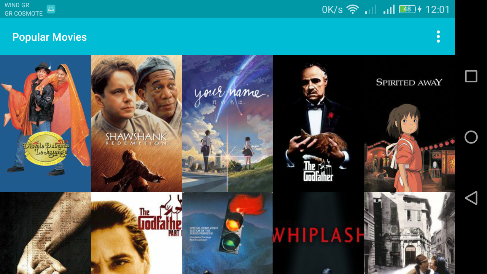
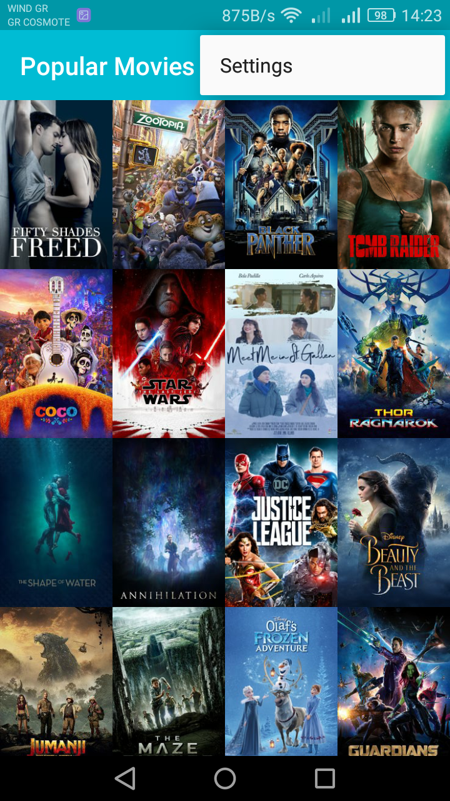
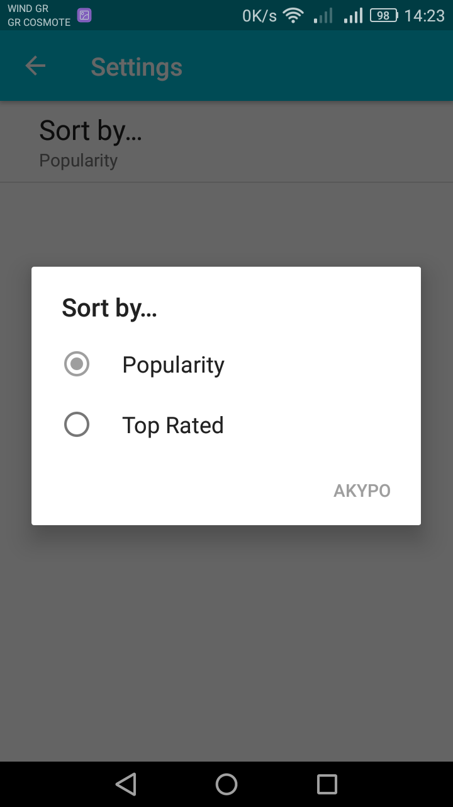
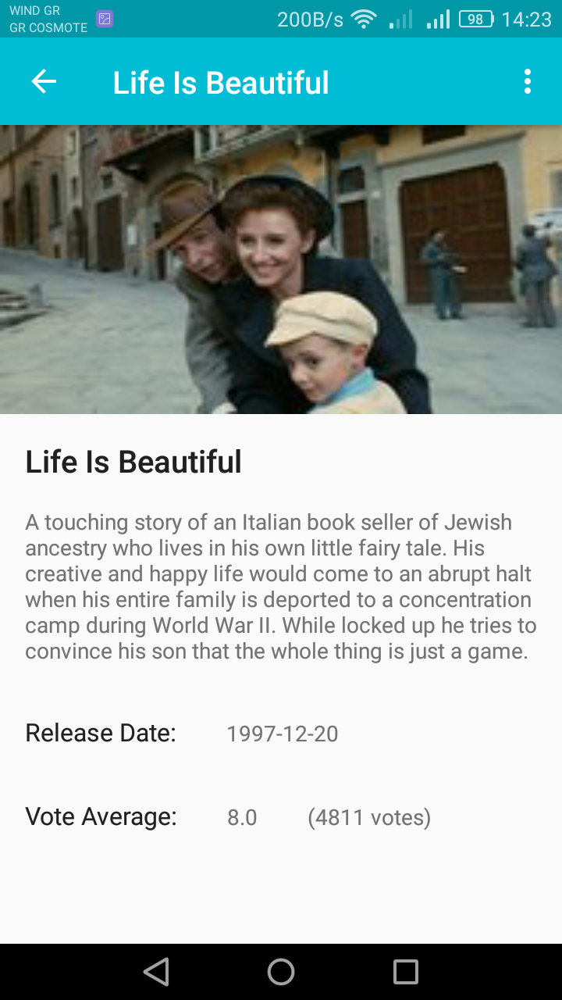
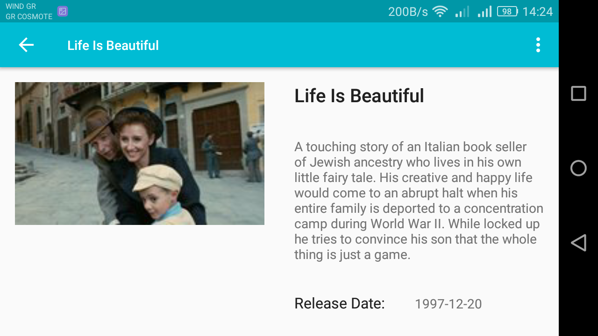

# Popular Movies App (stage1)
Popular Movies App is an app which displays the popular movies from The Movie Database (TMDb) sort by popularity or rating.

It is a project during Udacity's Android Developer Nanodegree Program.

This app:
<ul>
<li>Present the user with a grid arrangement of movie posters upon launch.</li>
<li>Allow your user to change sort order via a setting: The sort order can be by most popular or by highest-rated</li>
<li>Allow the user to tap on a movie poster and transition to a details screen with additional information such as:
<ul>
<li>original title
<li>movie poster image thumbnail
<li>A plot synopsis (called overview in the api)
<li>user rating (called vote_average in the api)
<li>release date
</ul>
</li>
</ul>

Through this project I learnt:
<ul>
<li>to fetch data from the Internet with theMovieDB API.</li>
<li>to use adapters and custom list layouts to populate list views.</li>
<li>to incorporate libraries to simplify the amount of code I need to write.</li>
</ul>

In order to use the app you should get an API key from themoviedb.org
Instructions are here: https://docs.google.com/document/d/1ZlN1fUsCSKuInLECcJkslIqvpKlP7jWL2TP9m6UiA6I/pub?embedded=true
And you should then put the key in build.gradle (Module app) where you can find THEMOVIEDB_API_KEY_GOES_HERE

<h2> App's screenshots</h2>

   

   

   

